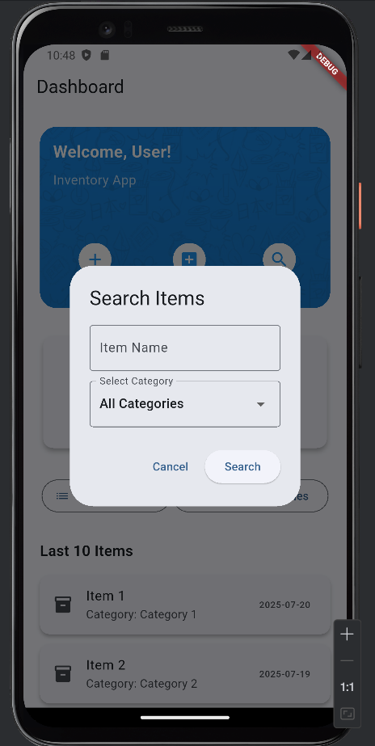
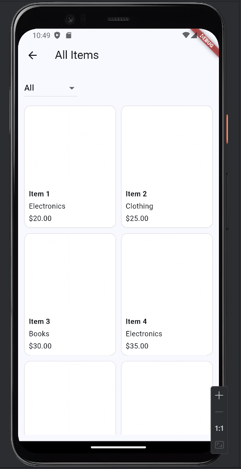
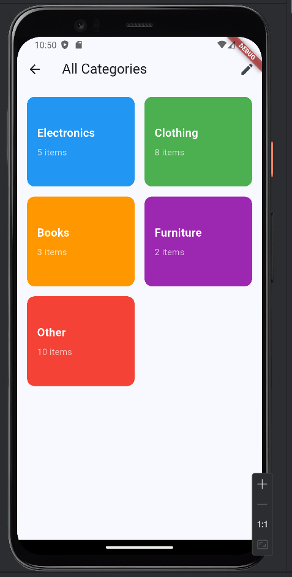

This artifact is part of my inventory management app. It includes the screen where all the items are shown in a grid layout, similar to a shopping app. I created the base of the app in a previous course, but this part was improved during my CS 499 project to show how I can use filtering and logic to organize data. It was built using Flutter in 2025.

I chose this artifact for the Algorithms and Data Structures category because it shows how I used filtering logic with lists and dropdowns. One key part is the dropdown menu that lets users choose a category like “Electronics” or “Books.” Based on what the user selects, the app updates the list and only shows items from that category. I also set it up so if the user clicks a category somewhere else in the app, it will open this screen and automatically filter the items. These improvements highlight my ability to work with data structures and apply simple but useful logic in real apps.

While working on this enhancement, I learned how to use didChangeDependencies() to get data from another screen and update the UI based on it. This was new for me, and it helped me understand how data moves between screens in Flutter. I also got better at writing logic that filters data from a list and displays it cleanly. A small challenge was making sure the category filter worked well when the screen first opened, I fixed this by updating the state properly. Overall, this helped me feel more confident using lists and logic in Flutter.

## Screenshots

### Search

### Items

### Categories

