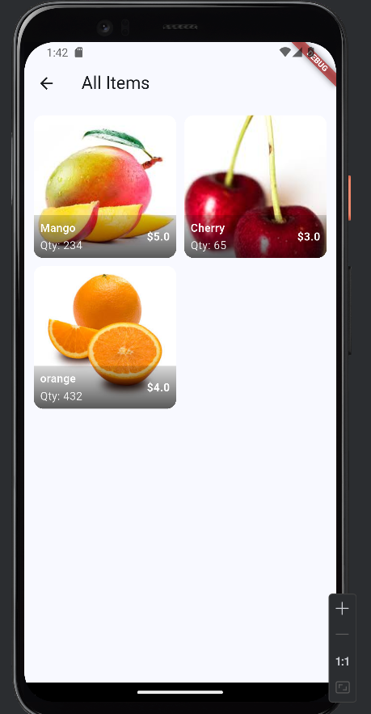
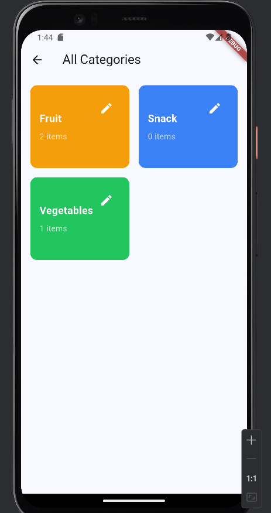
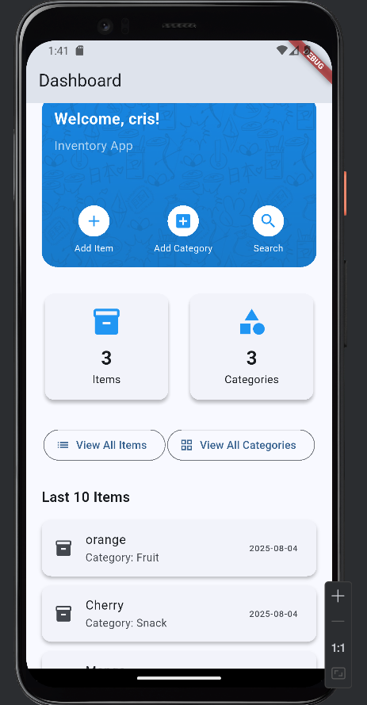

The artifact is a mobile inventory management application developed in Flutter as part of my coursework. It was originally created in a previous class with only basic local data handling, but I significantly enhanced it during this course. The enhanced version now connects to a Firebase Firestore database, allowing all inventory data to be stored, retrieved, and updated in real time. This required restructuring the application to work with a live backend rather than static data. In addition to database integration, I implemented the ability to upload and display images for each inventory item, which required subscribing to a paid cloud storage service to host and serve these images reliably. This transformation has turned the app into a more realistic, production-like inventory management solution.
	
I chose to include this artifact because it represents one of my most substantial improvements in both functionality and technical complexity. It demonstrates my ability to design and build a mobile application that communicates with a live backend, implements real-time database queries, and handles media uploads. The most notable enhancement was migrating from static data storage to a fully functional cloud-based solution with Firebase Firestore, which required learning a new database language and restructuring the data flow throughout the app. The addition of image uploading not only expanded the app’s capabilities but also introduced me to working with third-party cloud storage services, including setting up and managing a paid service for image hosting. 

Enhancing this artifact was by far the most time-consuming and challenging project I have worked on so far. Integrating Firebase Firestore meant learning its data structure, query constraints, and asynchronous operations from scratch, which took considerable research and experimentation. I also encountered challenges with indexing, query limitations, and ensuring data consistency across related collections. Implementing image uploads added another layer of complexity, requiring me to work with a separate cloud storage provider, handle file uploads, store URLs, and ensure images displayed correctly in the app. This feature alone introduced a cost factor, as I had to subscribe to a paid image hosting service to provide reliable and scalable storage. The process required a significant investment of time and problem-solving, but it ultimately improved my technical skills in mobile development, backend integration, and working with third-party services. The result is a far more capable, realistic, and production-ready inventory application.

## Screenshots

### Items (with Firebase data)

### Categories (with Firebase data)

### Dashboard (with Firebase data)

